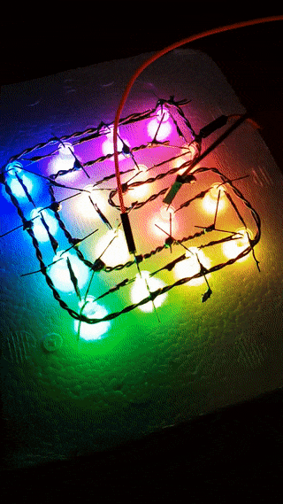
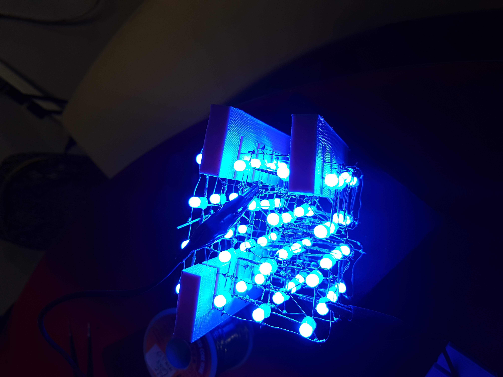
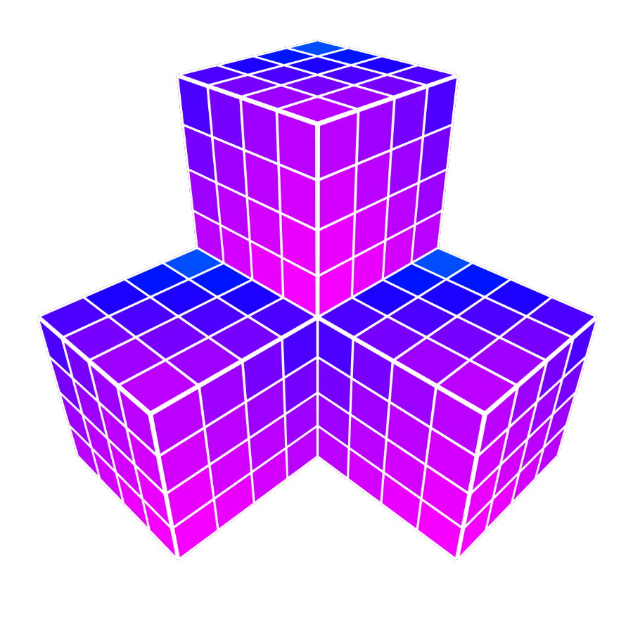
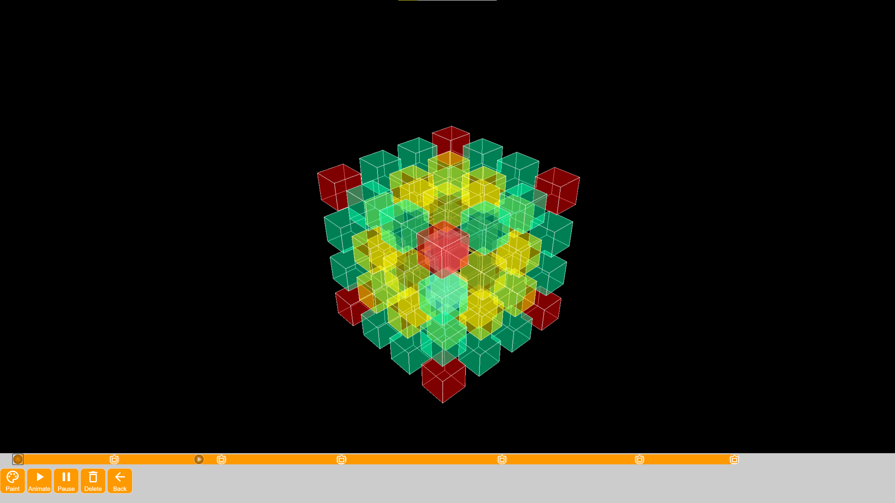

# StaxCube

> Provides exact control over StaxCubes

What is a StaxCube you may ask? It is a modular RGB LED cube that can stack with other cubes to create large 3D holographic displays.

Nice animation: <https://www.openprocessing.org/sketch/743283>

Try the editor: <https://tinkercademy.github.io/staxCube>

## Pictures

## Screenshots

